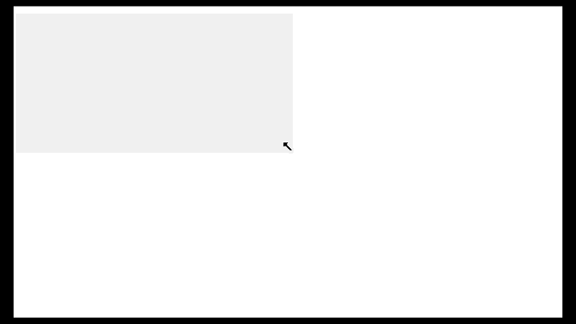

## Lab 6: DOM manipulation, Events and Objects in JS.
1. As demonstrated in the image below, make a draggable box.
	
2. Create an image gallery with next and previous arrows so you can cycle through the pictures.
3. Review the [tic-tac-toe](https://codepen.io/janschreiber/pen/xZbEvM) app and make a list of the concepts you learned from it.
4. Create a sortable list as in the picture below
	